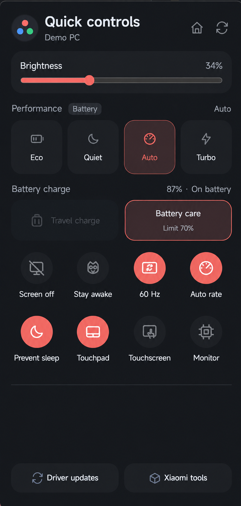
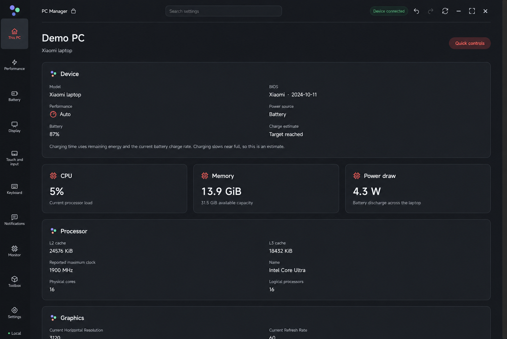
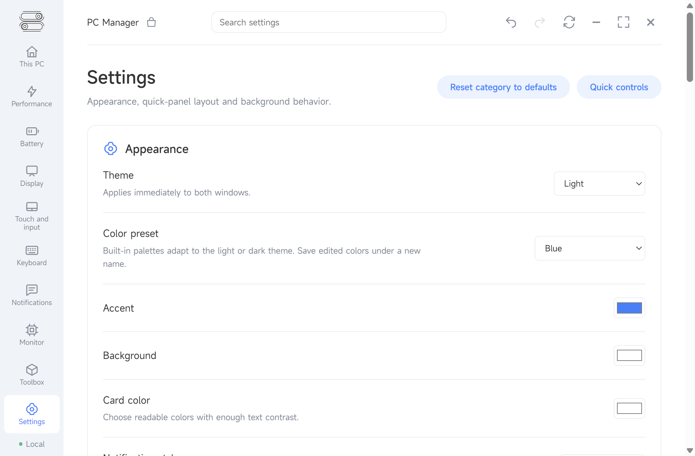
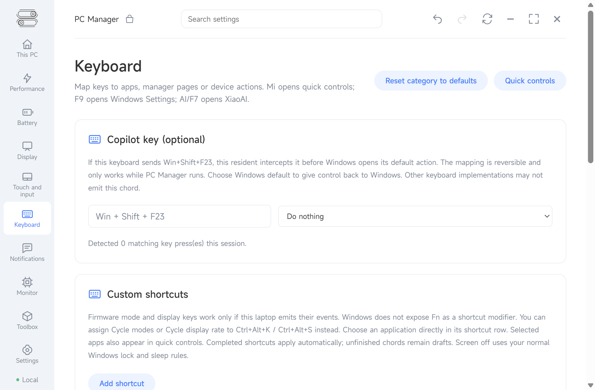
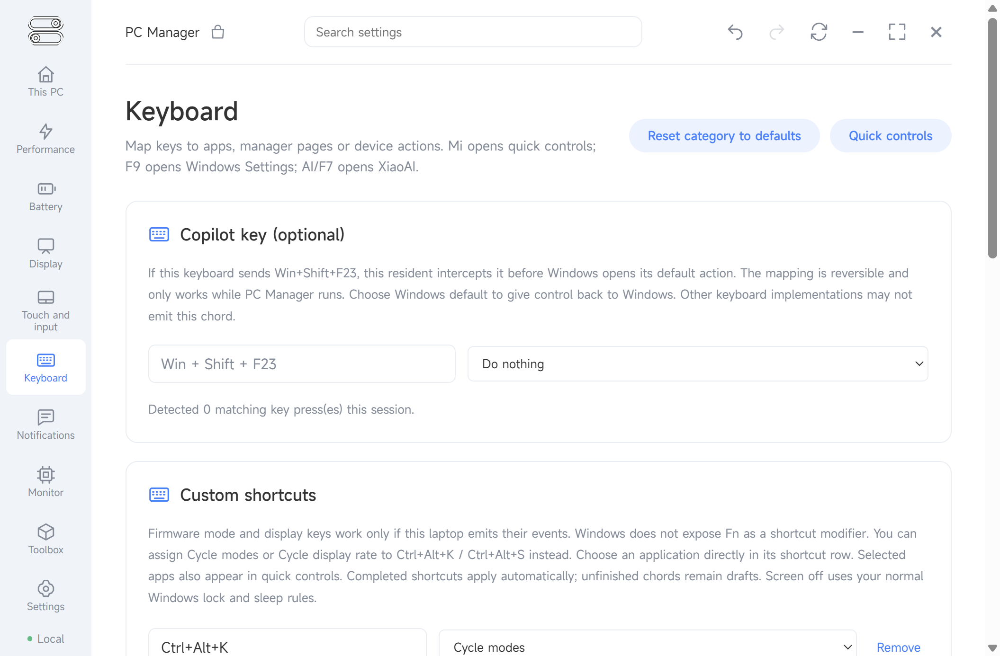
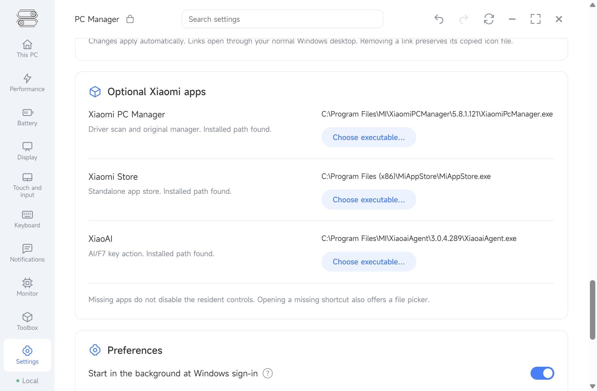
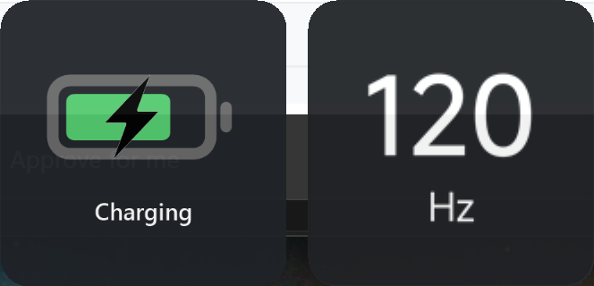

# PC Manager for Xiaomi laptops

An English, Xiaomi-style quick panel for everyday laptop controls, with a larger manager when you need more detail. It runs in the Windows tray and uses Xiaomi firmware controls adapted from [XiControl](https://github.com/Oksion/XiControl). This is an independent community project, not an official Xiaomi app.

  
  

*Screenshots use illustrative device names and settings. Available controls depend on the Xiaomi laptop model.*

## Get started

1. Download **PCManager-Setup.exe** from the [latest release](https://github.com/Alex-Irae/Xiaomi-PC-Manager-Extended/releases/latest).
2. Choose **Install for all users** to use the default `C:\Program Files\Xiaomi Revamp\PC Manager` folder, or choose **Install for this user only**. You can browse to a custom folder in either mode. Run setup while signed in to a Windows administrator account and approve the Windows permission prompt. Setup checks for the **.NET 8 Desktop Runtime** and **Microsoft Edge WebView2 Runtime** and tells you if either is missing. The installer is not code-signed, so Windows may show an unknown-publisher warning.
3. Open **PC Manager** from Start or its tray icon. On supported keyboards, the Xiaomi/Mi key opens Quick controls.

Setup installs `PCManager.exe`, starts it with Windows for the installing account, and turns off Xiaomi's original popup service so the two panels do not overlap. The all-users choice shares the application and Start menu shortcut; each Windows account keeps its own settings and can enable its own startup task. It leaves Xiaomi's drivers and firmware interfaces installed. You can still open Xiaomi's own manager for its driver scan, and the uninstall dialog can restore the original popup.

Prefer a ZIP? Extract **PCManager-portable.zip** from the same release and run **Install PC Manager.ps1** inside it. Its default destination is also `C:\Program Files\Xiaomi Revamp\PC Manager`; use `-Scope CurrentUser` or `-Destination` to change that. Simply extracting the ZIP does not register startup or change Xiaomi's popup service.

## What you can do

| Quick controls | Larger manager |
| --- | --- |
| Change brightness and the performance mode. AC and battery each remember their own mode. | See device specifications, battery information, processor and memory usage, and available power readings. |
| Use battery care or a one-time travel charge to 100%. | Set the persistent battery target, display behavior, touchpad and touchscreen options, and keyboard actions. |
| Switch refresh rates, use automatic AC/battery rates, open the hardware monitor, or turn off the display. | Choose light or dark themes, colors, button order, app shortcuts, and notification position. |
| Open Xiaomi's driver scan or tools when those optional apps are installed. | Search settings, reset a category to defaults, and export or import a settings backup. |

Most changes take effect when you select them. The panel remains open after a control is changed, so you can make several adjustments at once. Click outside it to dismiss it. The Home icon opens the larger manager. Keyboard mappings, including the optional Copilot key on supported keyboards, live in **Keyboard**.

In **Settings → Appearance**, changing a color switches to Custom. You can save the three colors as a named palette, then select that palette to rename or delete it. Deleting the selected palette leaves its colors in place as Custom; Undo can restore the saved palette during the current session.

**Prevent sleep** is separate from **Stay awake**: it asks Windows to keep work running while allowing the display to turn off. Windows Modern Standby can still limit long-running work on battery. **Screen off** sends a one-time display-off request; it is not a guarantee that Windows will stay awake. The hardware monitor offers small, medium and large views, with optional CSV logging.

## Screenshots

| Appearance and colors | Remap keyboard actions |
| --- | --- |
|  |  |

| Custom shortcuts | Optional Xiaomi applications |
| --- | --- |
|  |  |

When charging and an automatic refresh-rate change happen together, their on-screen notices appear side by side:

The light settings screenshots and dark quick-panel screenshot show different available themes. The screenshots are examples; they do not promise that every control is supported by every Xiaomi laptop.

## Privacy and permissions

- Everyday hardware controls run locally. There is no account requirement or cloud sync. Preferences, custom images and optional diagnostic logs stay on your PC under `%LOCALAPPDATA%\XiaomiAIManager`.
- Core controls work without internet. The optional XiControl release notification can contact GitHub when enabled. Opening Xiaomi Store, driver links, or a user-configured webhook/API may use the network. The API and webhooks are off by default.
- Administrator approval is needed for the background startup task and reversible Xiaomi popup-service isolation. The app does not need XiControl installed as a separate program.
- **Settings → Export backup** creates a ZIP of your preferences, profile image and custom artwork. Keep it private: it may contain personal file paths. Use **Import backup** to restore it after a reinstall.

## Compatibility and removal

This release was tested on a **Xiaomi Book Pro 14 (TM2424)** running Windows x64. Firmware controls need a compatible Xiaomi interface; some functions, key events and sensor readings vary by model. Xiaomi PC Manager, Xiaomi Store and XiaoAI are optional, but their related shortcuts need those apps to be installed or selected manually. Driver scanning uses Xiaomi's own manager.

Uninstall through **Windows Installed apps**. The uninstaller asks whether to restore Xiaomi's original popup service. Export a private settings backup first if you want to keep your preferences. Shared .NET and WebView2 runtimes remain installed because other apps may use them.

For build instructions, component details, validation results and known hardware limits, see the [technical README](docs/TECHNICAL.md). See also the [v0.1.6 release notes](RELEASE_NOTES.md).

## Credits and license

Project direction and physical laptop testing: **Irae**. Substantial implementation, integration and validation assistance: **GPT-6 Sol (OpenAI Codex)**. Firmware/backend and monitor code reuse **XiControl 0.16.0**, with its authorship and GPLv3 terms retained. Xiaomi names and supplied artwork remain associated with Xiaomi. Source and redistribution terms are in [LICENSE](LICENSE).
