# Xiaomi Revamp screenshot tour

Screenshots show the current interface with demonstration data. Hardware readings, file names, progress and device states are examples, not performance measurements or your personal files.

## PC Manager

### Pc manager overview

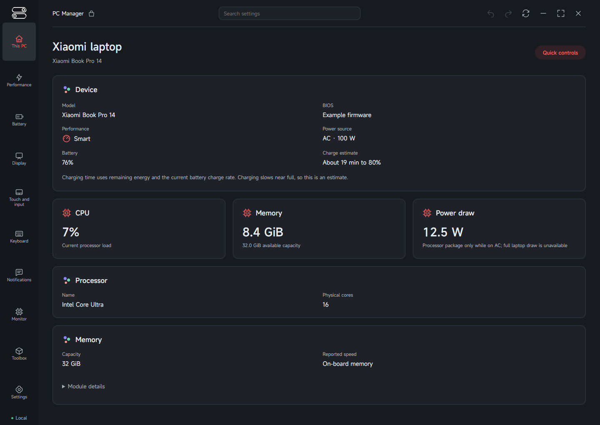

### Pc manager battery

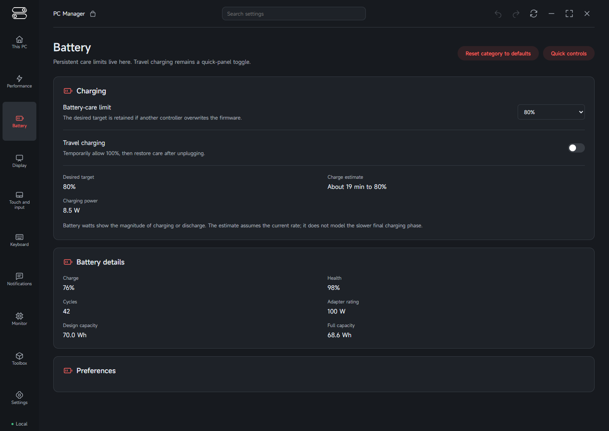

### Pc manager shortcuts

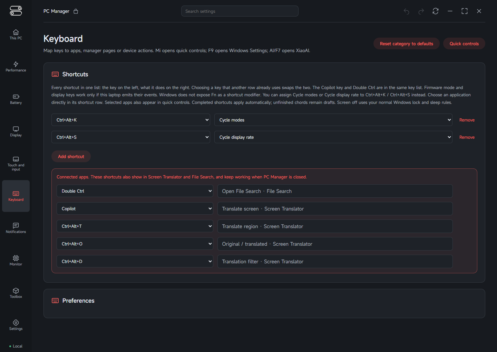

### Pc manager apps

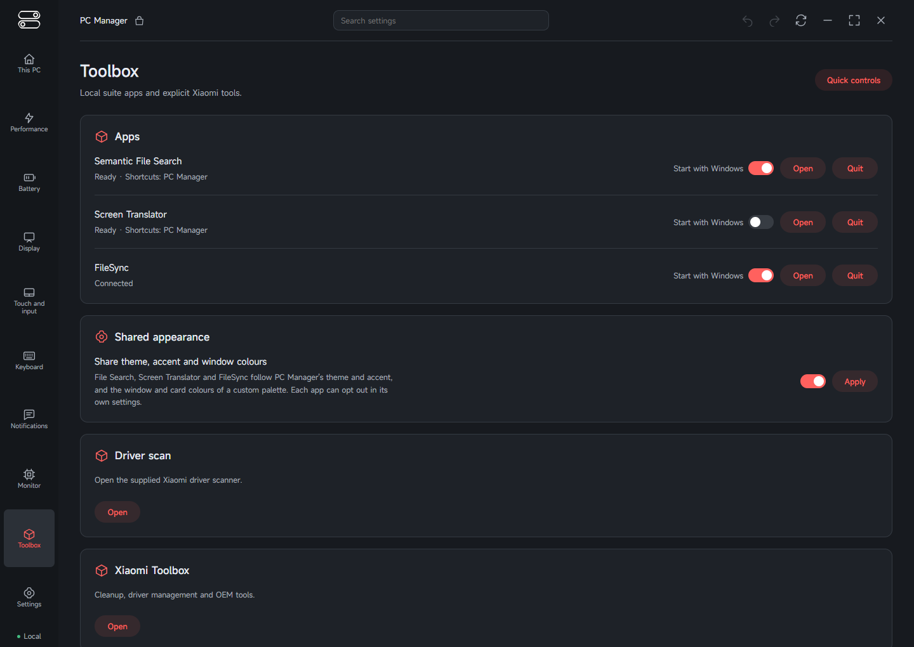

### Pc manager quick controls

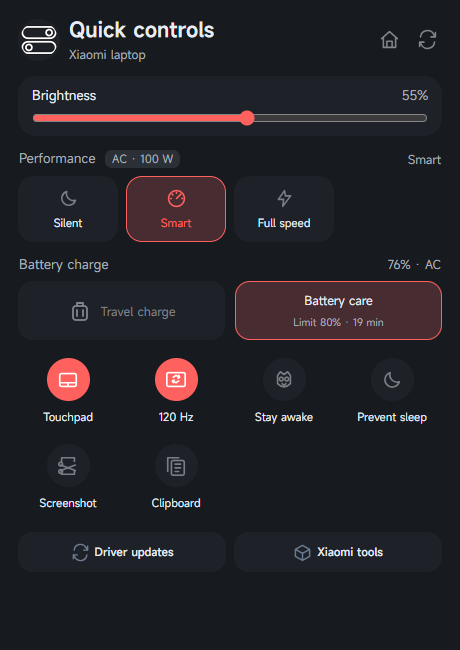

## AI Center and File Search

### Ai center launcher

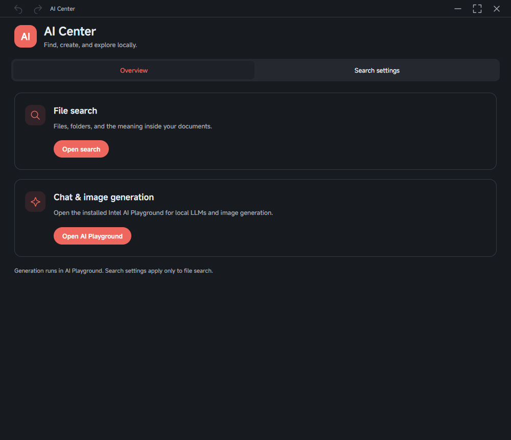

### Ai center settings

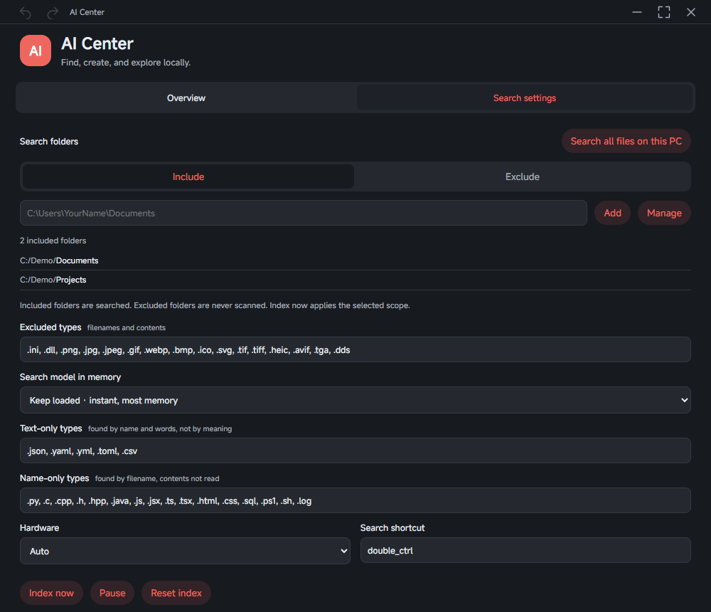

### Ai center indexing

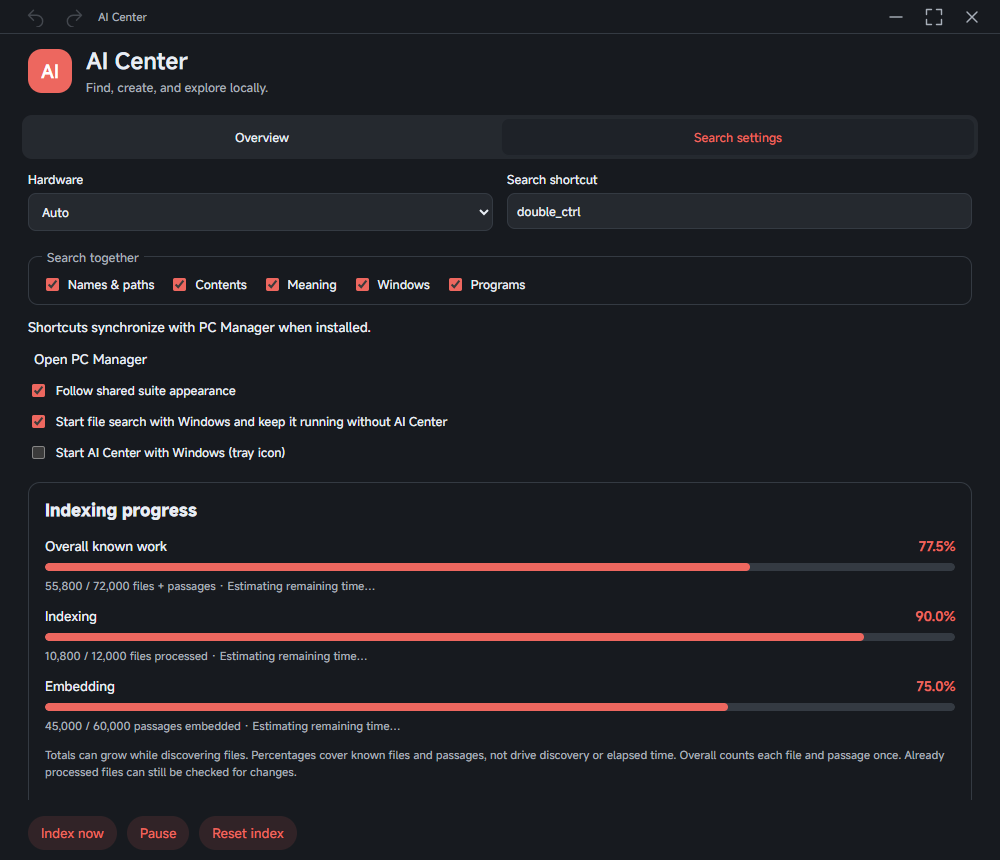

### File search results

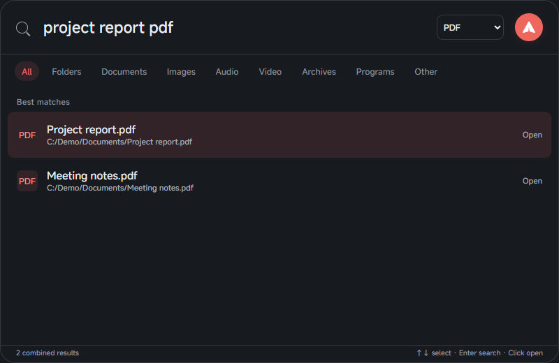

### AI Center index backup

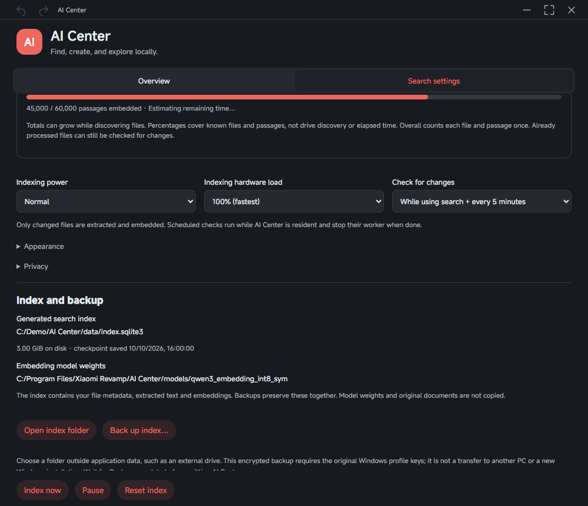

## Screen Translator

### Screen translator overview

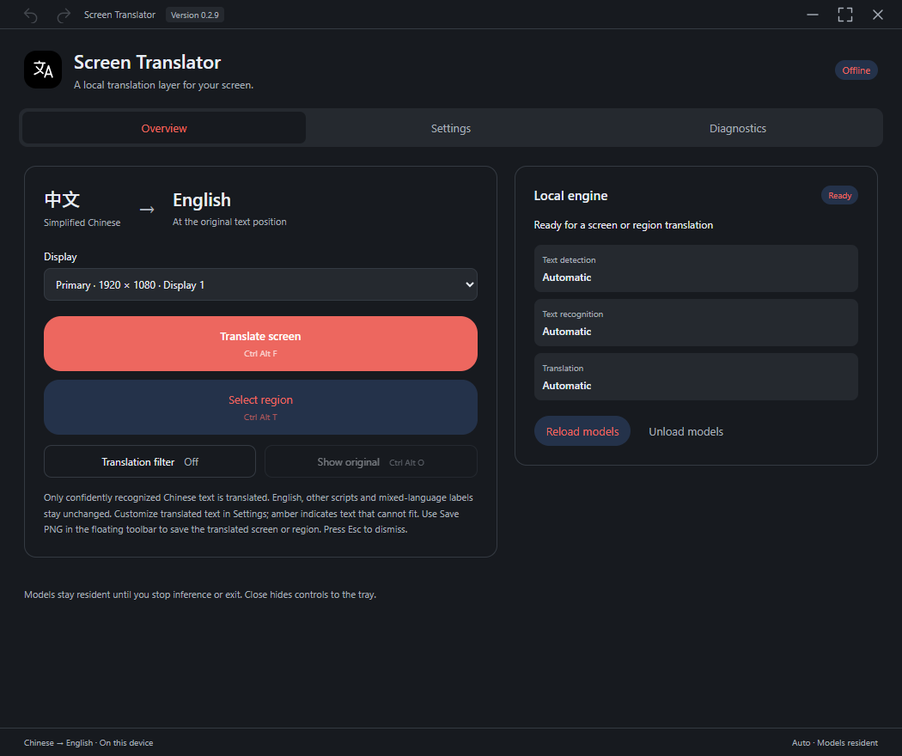

### Screen translator settings

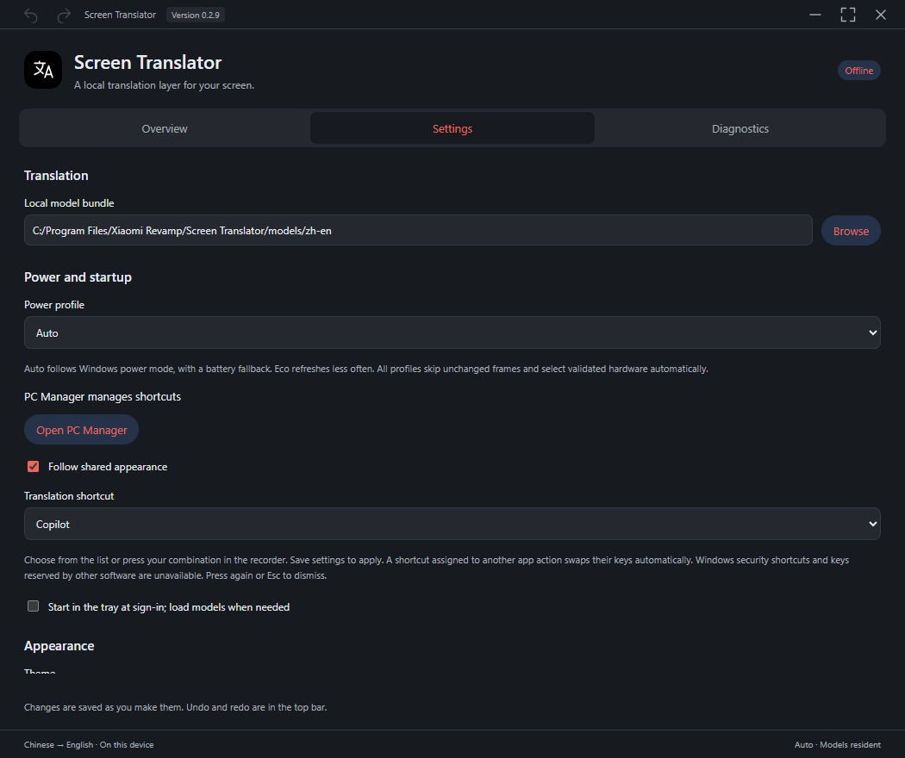

[Back to the user guide](../README.md)
